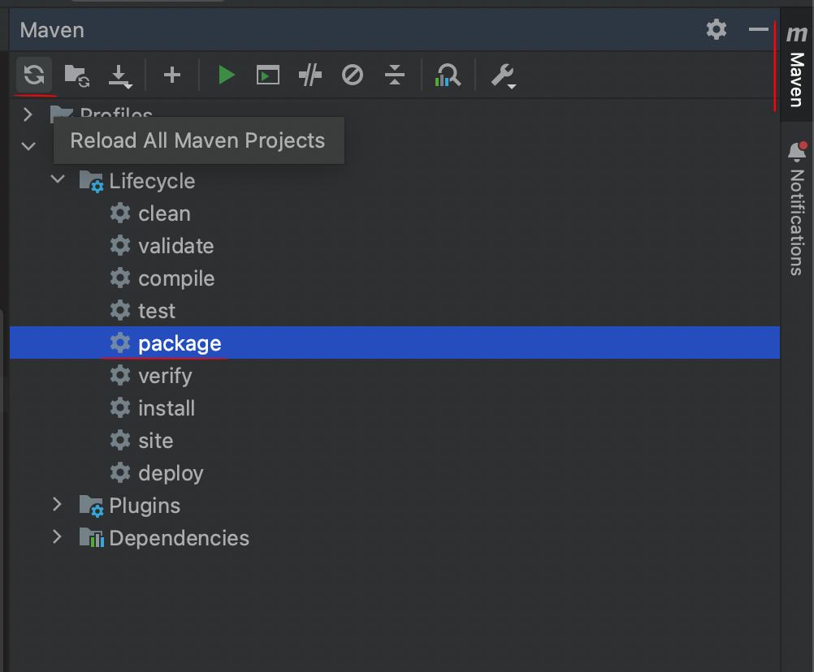
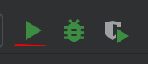

<h1>Cardápio Digital - Backend</h1>

<p align="center">
  <a href="#pre-requisites">Pré-requisitos</a> •
  <a href="#how-to-use">Instalando o projeto</a> •
  <a href="#related">Frontend</a> •
  <a href="#license">Licença</a>
</p>

Essa aplicação foi desenvolvido durante o video [Construindo aplicação Fullstack do ZERO](https://youtu.be/lUVureR5GqI?si=d-fHBagSO6bjX58G) utilizando **Java Spring e Spring MVC** para criação do servidor, **Spring Data JPA** para manipulação e persistência de dados, **Lombok** para geração de boilerplates e Postgres Driver para realizar a conexão com banco de dados Postgress.

<h2 id="pre-requisites">💻 Requisitos</h2> 

Para rodar esse projeto você precisa ter o Java instalado na sua máquina.

<h2 id="how-to-use"> 🚀 Instalando o projeto</h2>

Primeiro você deve clonar o repositório,

```bash
# Clone o repositório
$ git clone https://github.com/fernandakipper/crud-java-back

# Acesse-o
$ cd crud-java-back
```

Agora, dentro do IntelliJ, vamos instalar as depedências com o Maven



E por fim, entre no arquivo da classe `CardapioApllication` para executar o projeto



<h2 id="related">🫂 Integração com Frontend</h2>

Para realizar a integração com o Frontend, você pode clonar o projeto e rodar localmente, ou desenvolver você mesmo seguindo o tutorial no Youtube.

👉 [Desenvolvendo o Frontend desse Cardápio Digital com React e Typescript](https://www.youtube.com/watch?v=WHruc3_2z68)

👉 [Link do repositório](https://github.com/Fernanda-Kipper/frontend-cardapio-digital)


<h2 id="related">📝 Licença</h2>

Este projeto está licenciado sob a licença MIT. Consulte o arquivo `LICENSE` para obter mais informações.


## 📱 Minhas Redes

Meu site: [fernandakipper.com](https://www.fernandakipper.com) &nbsp;&middot;&nbsp; 

Instagram: [@kipper.dev](https://github.com/kipper.devb) &nbsp;&middot;&nbsp;

YouTube [@kipperdev](https://www.youtube.com/@kipperdev) &nbsp;&middot;&nbsp;

